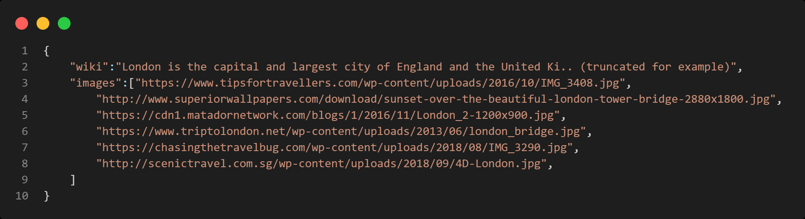
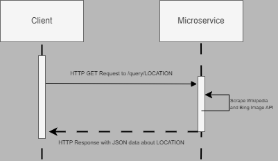

# Communication Contract

This microservice uses a REST API for communication. The service can be deployed anywhere that it can be accessed, including `localhost`. The default port is 8080, but this can be configured in environment variables. The following examples assume the service is hosted on `localhost:8080`.

## Request
The microservice implements a single API endpoint which can be reached by the following path:

`localhost:8080/query/<LOCATION>`

To request data from the endpoint, make an HTTP GET request to that path on the server, replacing `<LOCATION>` with the name of the location you are querying. For example, to query information about London, you would make a request to
`localhost:8080/query/London`. Spaces in the location name are valid.


## Response
The service responds to each HTTP request with a response containing a string represention of a JSON object of the following form:
```json
{
    "wiki": "Description is here",
    "images": ["image_link_1", "image_link_2", "...", "image_link_n"]
}
```
The `wiki` key holds a string value that contains a description of the location queried. The `image` key contains a list of arbitrary length of links to images of the location.




## UML Sequence Diagram of Communication

